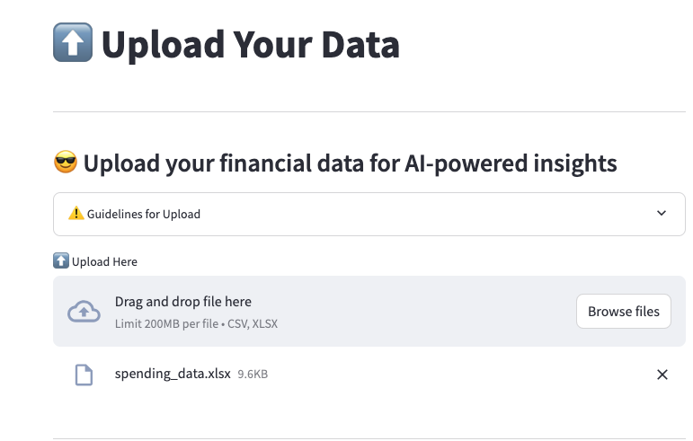
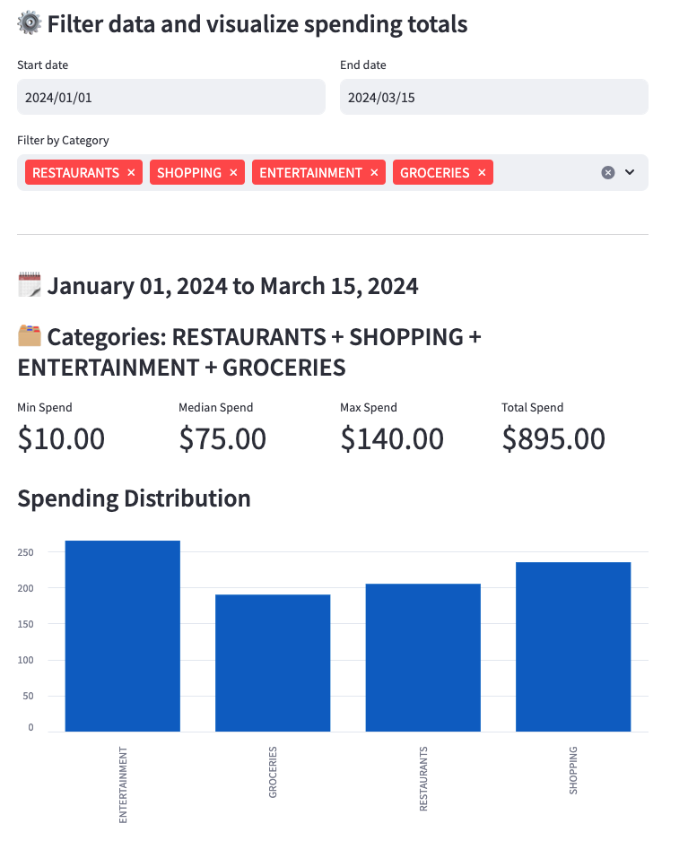
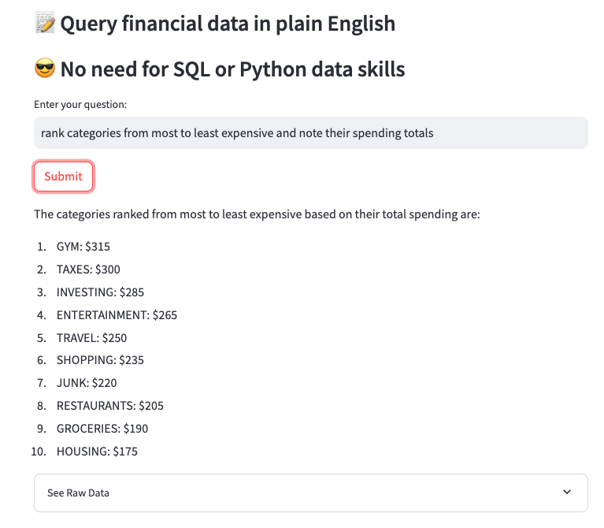
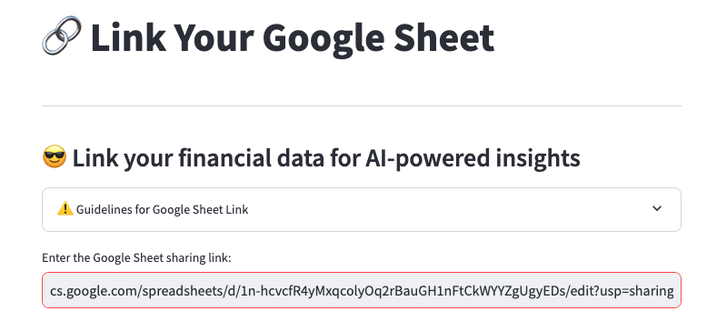

# 📗 Welcome to PocketBook AI

**👨🏻‍💻 I built Pocketbook AI to give myself a personal finance tool** after [Mint shut down](https://www.cnbc.com/select/mint-app-shutting-down-what-users-should-do/) at the end of 2023. 

🔄 **This tool uses** data visualization and AI to streamline analysis

[**👀 See PocketBook in action**](https://hurshkarkhanis.com/mint)

  
🧰 Technical Specifics for Developers

  
   
  
  I built the front end with [Streamlit](https://docs.streamlit.io/library/api-reference)
  
  Most of the structured data is in [Pandas DataFrames](https://pandas.pydata.org/)
  
  I used [dotenv](https://www.npmjs.com/package/dotenv) to access my Open AI API Key
  
  I used [Streamlit-Gsheets](https://github.com/streamlit/gsheets-connection) to connect to Google Sheets data
  
  I used Open AI's [GPT 3.5 Turbo](https://platform.openai.com/docs/models/gpt-3-5-turbo) model
  
  I used [Langchain](https://www.langchain.com/), an LLM framework for chat functionality

**📸 Screenshots Below:**

User can upload their own data for analysis

Users can use interactive filters, metrics and visualizations

User can "talk to" data ; querying it in plain English!

User can connect to Google Sheet data too

**[⏮ Back to hurshkarkhanis.com](https://www.hurshkarkhanis.com/)**
